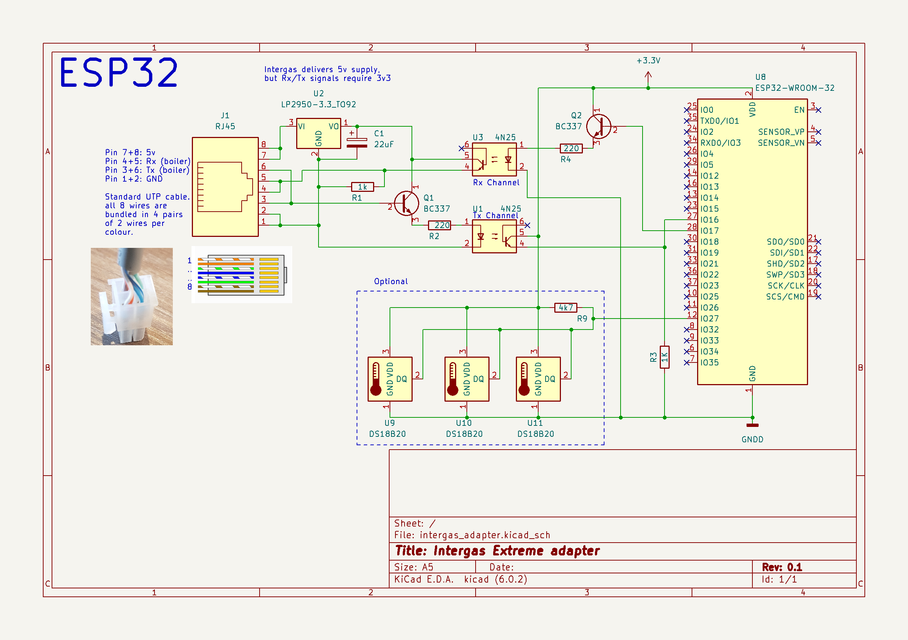
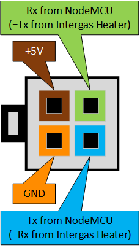
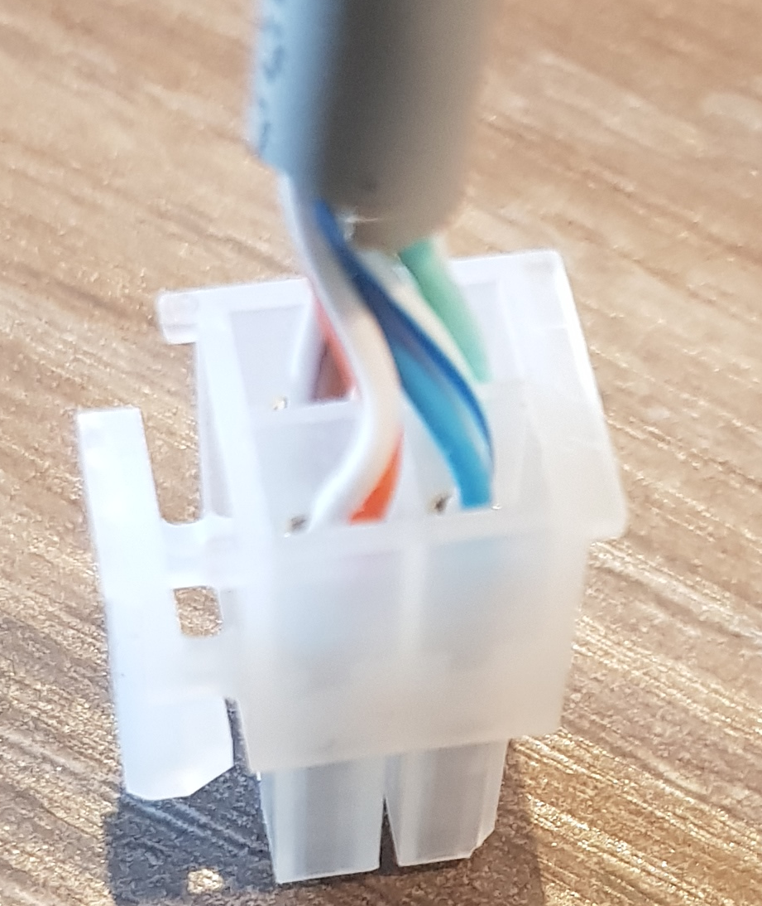

# Home-Assistant Intergas Central Heating monitor

This project provides the necessary tools and scripts to monitor a Intergas
central heating system via the IDS interface.

It connects an ESP32 NodeMCU board through optocouplers to the burner control
board of the Intergas Xtreme. From there detailed statistics are published to
Home Assistant for accurate monitoring of the device.

This project has only been tested with a Intergas Xtreme 36 central heater.

# Home Assistant
The connection to Home Assistant is done via ESPHome and Wifi.

# Physical connection

Prerequisites for the physical connection:
* Cable required that connect to the X14 connector of the burner control board.
  The type of connector is a Molex Mini-Fit, Jr. connector housing with female
  terminals.

  For reference, the connector is:
  * [Molex part number 39-01-2200](https://www.conrad.nl/p/molex-39012040-mini-fit-jr-receptacle-housing-dual-row-4-circuits-ul-94v-2-natural-2448286), and
  * [the terminals are Molex part number 5556](https://www.conrad.nl/p/molex-39000078-100-pcs-mini-fit-female-crimp-terminal-tin-sn-over-copper-cu-plated-brass-16-awg-bag-2448254).

  This is also the same type of connector you can find on old ATX Power Supplies.

* As opto coupler we use the [4N25](https://www.conrad.nl/p/lite-on-optocoupler-fototransistor-4n25-dip-6-transistor-dc-1127375) type.

* As controller we use:
  * a [NodeMCU-32s (ESP32)](https://esphome.io/devices/nodemcu_esp32.html) Development board


# Schematics design

Schematics of the IDS adapter is designed with KiCad.



# Cabling
The intergas heater provides a 5V power supply via the X14 connector, but the datalines require 3,3V.

|||


# SW Installation

Here are the installation steps for the software in ESPHome:
* First install the ESPHome toolset on Home Assistant via the Addon Store.
* Open an SSH session to your Home-Assistant instance, then
  ```
  $ cd config
  $ git clone https://github.com/little-chef/intergas-xtreme-monitor.git esphome/intergas-xtreme
  $ echo '<<: !include intergas-xtreme/esphome/intergas-xtreme-monitor.yaml' > esphome/intergas-xtreme-monitor.yaml
  ```
  Next create the config/secrets.yaml file and add the following lines:
  ```
  esphome_hassio_api_encryption_key: my-32-byte-base64-encryption-key
  esphome_hassio_ota_pw: my-very-secure-ota-pw
  esphome_wifi_network_ssid: my-wifi-access-point
  esphome_wifi_network_password: my-wifi-password
  esphome_wifi_ap_fallback_password: my-fallback-password
  ```
  The api_encryption key is explained here: https://esphome.io/components/api.html?highlight=randomly%20generated

* Go to the ESPHome dashboard on Home Assistant, the new device should be visible. From
  here you can compile the firmware for the NodeMCU, and install it to NodeMCU device.
* Once the device is running, a new notification will pop up to register the device to your
  Home Assistant instance. Complete that procedure.
* After everything is successful, the metrics will become visible on the Home Assistant Dashboard.

# External references:

The code and content have been inspired by these public sources:
* https://github.com/keesma/Intergas-Central-Heating-Monitor-Homie
* https://www.circuitsonline.net/forum/view/80667/last
* https://github.com/rickvanderzwet/IntergasBoilerReader
* https://github.com/Meewis/ESP8266_MQTT_INTERGAS
* https://gathering.tweakers.net/forum/list_messages/2056344
* https://theintergasshop.co.uk/content/181-intergas-boiler-manuals -> IDS X Range Software

# Why is the ESP8266 NodeMCU not supported anymore
The monitor adds a lot of sensors to the Home-Assistant dashboard.
The ESP8266 will run into memory fragmentation issues that impacts its stability.
Also, the webserver cannot be enabled and OTA updates go very slow and will result
in timeouts on the Wifi connection. Frequently updates need to be done via USB due
to all failures. Furthermore, the amount of UARTs are limited in the ESP8266, and
some port and pin swapping is required to prevent polluting the data flow towards
caused by the bootlogging of the ESP8266.
The more powerful ESP32 does not show these kind of issues, and is therefor preferred.

# Final Note:

Note that nothing in this project is supported by Intergas, neither is
there any guarantee that the provided materials will work in your environment.
Be aware that making mistakes in setting up the project may damage your heater
or void your warranty. Use of anything provided of this project is at your own
risk.
